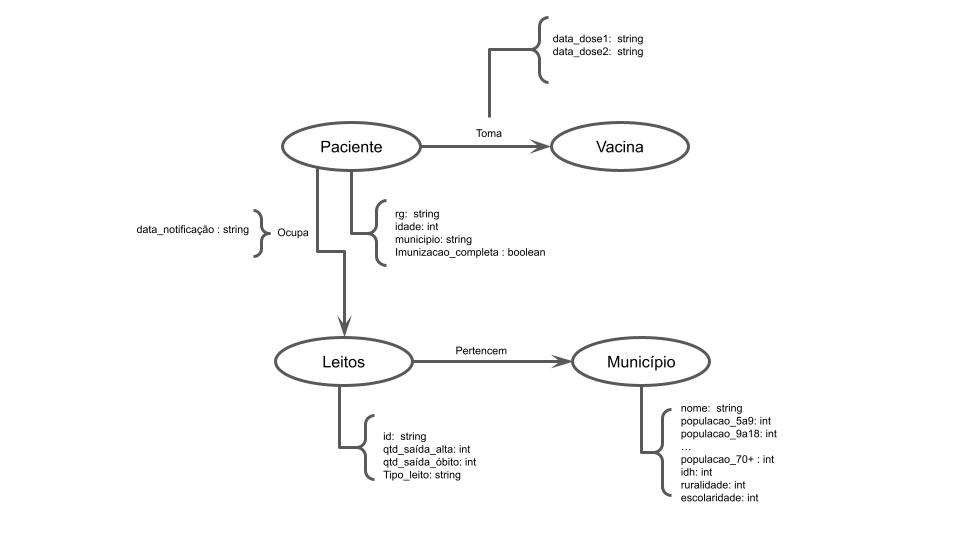

# Aluno
* 176622: José Henrique Dioz Récio

## Modelo Lógico do Banco de Dados de Grafos

## Perguntas de Pesquisa/análise

 * O índice de escolaridade do município influencia na velocidade/aderência da vacinação pela população local?

 * O índice de ruralidade do município influencia nos óbitos e na velocidade/aderência da vacinação?
 
 * Quantas pessoas, por faixa etária, foram internadas em um determinado período de tempo em determinada cidade? Destas, quantas tiveram alta ou foram a óbito?